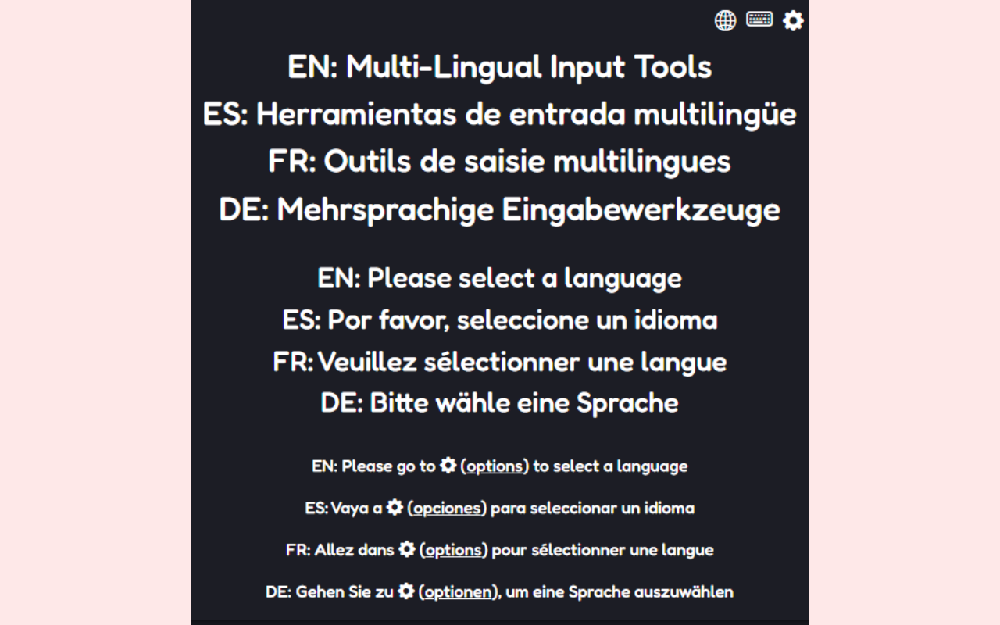
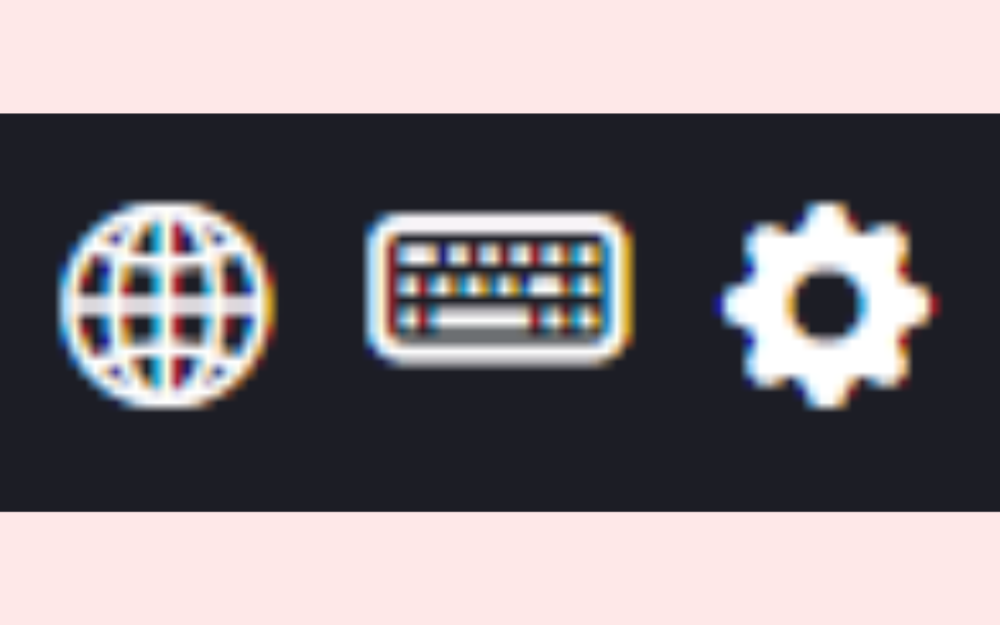
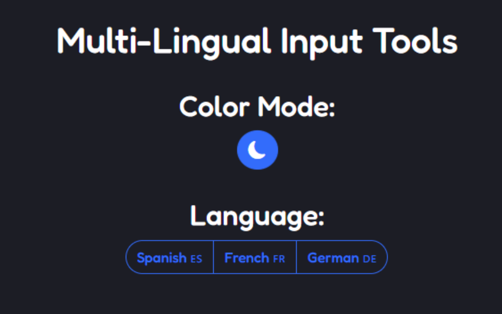
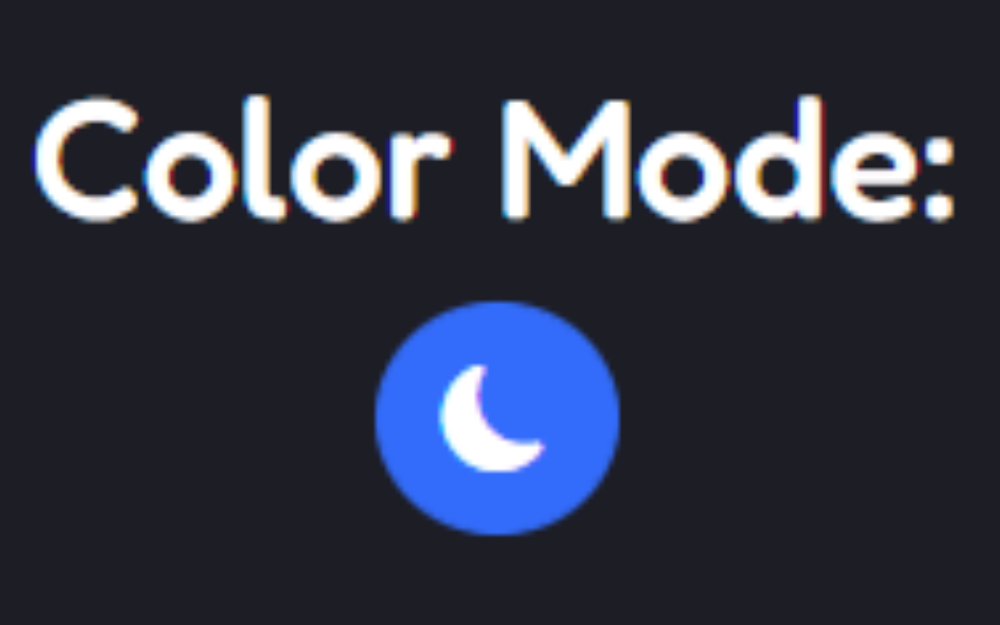
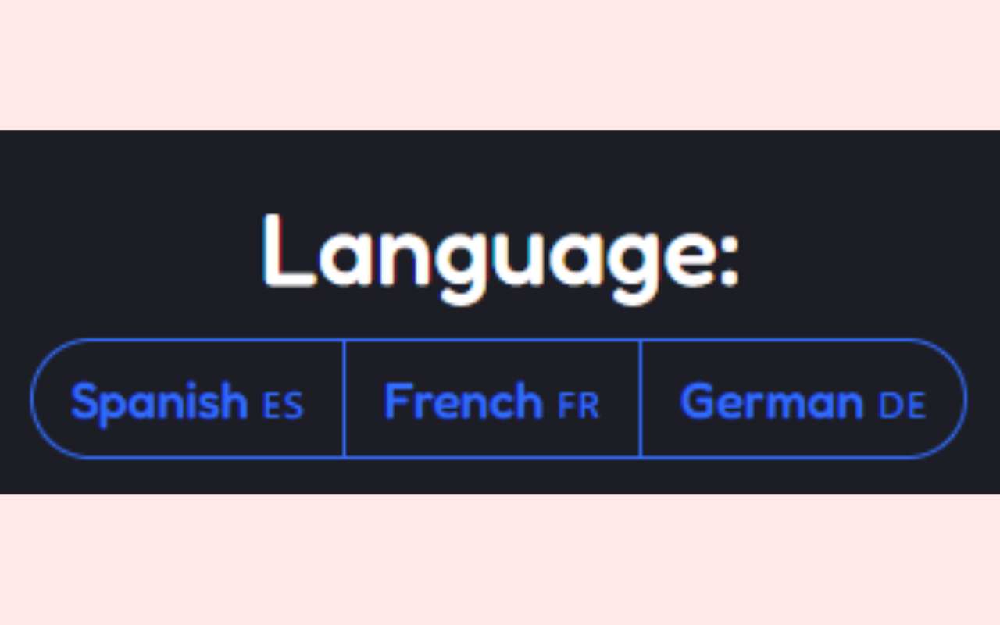

# Multi-Lingual Input Tools
# Info:
ℹ️ Multi-Lingual Input Tools is a browser extension developed by me ([@devsai9](https://github.com/devsai9)). It helps its users to easily copy & paste accented letters and symbols that are not on the English QWERTY keyboard from a variety of languages (languages still being added).
### Installation:
🛒 It is currently avaliable on the [Chrome Webstore](https://chrome.google.com/webstore/detail/multi-lingual-input-tools/dkbgodmmblfcnfledmedmepimmpebnjo?hl=en) and [Microsoft Edge Addons](https://microsoftedge.microsoft.com/addons/detail/multilingual-input-tools/aoehggnalolhonphifnooepocfjpghfl)

# Privacy Policy:
Privacy is an upmost importance to us. Please read the [Privacy Policy](PRIVACY.md).

# Contribute:
Coming Soon

# Setup After Installation
After installing the extension and launching the popup. You will be prompted to select a language from settings/options. The color mode is by default set to dark, but can be changed to light.   
Prompt Mentioned above: 

To get to settings at any time by going to the menu in the top right corner of the popup:  
  
and click the gear icon:  
  
After that you will be on a page that is similar to the image below:  
  
Here you can switch the light/dark mode setting:  
  
And the Selected Language:  
  

# Contact & Support: 
[Support Discord Server](https://discord.gg/Kz4WVK9qP4)

